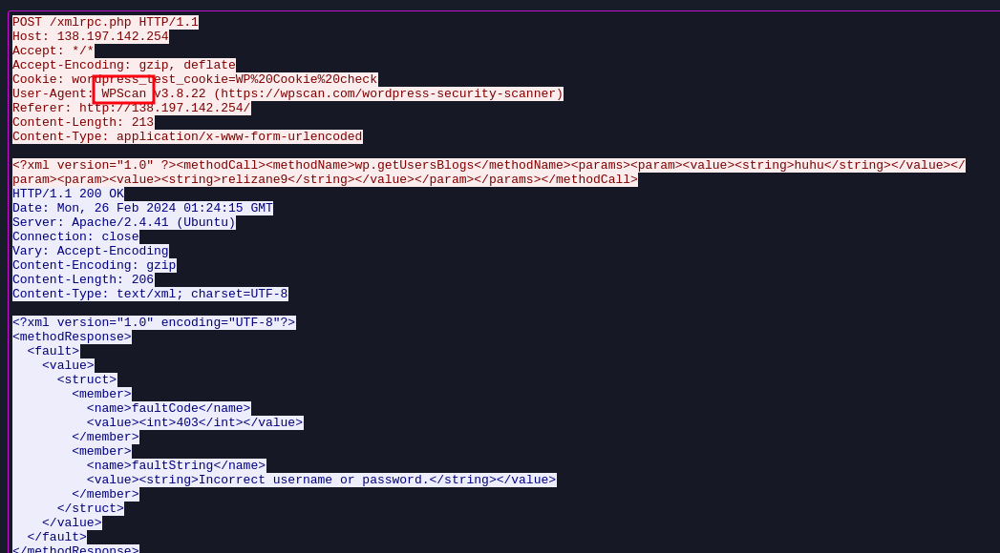
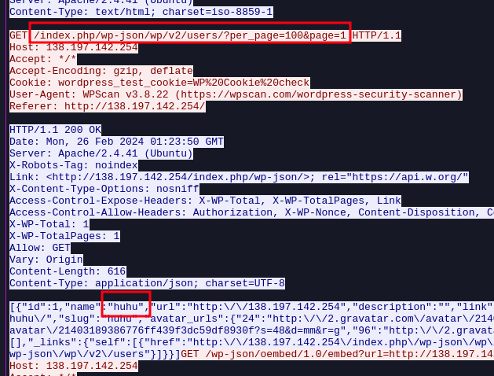
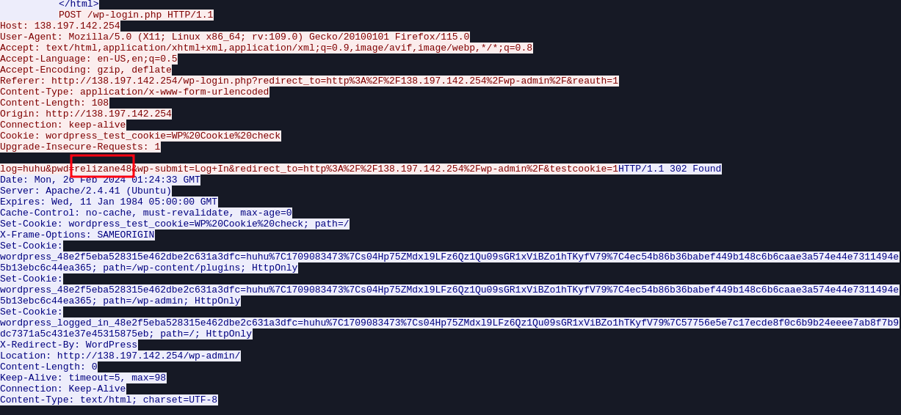

# Relizane is Down 2

**Difficulty:** Medium 
**Category:** Forensics 
**Source Files:** Available (pcapng)
**Authors:** @Houssem0x1 & 0utc4st 
**Description:** The attacker and with the help of some tools, managed to get admin  creds and accessed the admin dashboard where he abused a vulnerable  plugin to read sensitive system files.

- Mention the names of two tools that the attacker used in the attack. (alphabetical order and lowercase)
- What is the username and the password of the admin account?   (lowercase) 
- What is the name of the plugin? (lowercase)

**Flag format: nexus{ToolOne_ToolTwo_user:pass_PluginName}**

## Solution

### Tool names

we already identified the name of the first tool used by the attacker in the previous challenge which is `sqlmap`, now we need to find the second one.

after the packets of the sql injection testing are gone, we encounter a lot of requests to the `xmlrpc.php` page which is responsible for authentication in wordpress, if we follow one of the stream by right clicking then `Follow > Http stream` we get this :



we see `wpscan` which is a famous tool known for WordPress security scanning, now we have both the tools.

### user & pass

now we saw wpscan, this hints that the attacker may had brute forced the wordpress authentication.

a famous way to search for wordpress users is by going to this path `/index.php/wp-json/wp/v2/users/`, we follow the http stream of wpscan, and there we spot that path, and the username returned :



we have the username : `huhu`

now we need to find his password.

after the last packet for the `xmlrpc.php` page, we see a POST request to `/wp-login.php` which indicates an authentication attempt to the administration panel, if we follow the stream of that packet we get this :


we see that the attacker attempted to authenticate using the username `huhu` and the password `relizane48`, and that worked since the response was with the 302 status code redirecting t `/wp-admin` and setting a cookie which indicates a successful authentication.

this means we have the password : `relizane48`

### PluginName
Following The hacker's methodoly and packets sequence we can see in packet 3779 an HTTP respose with the content of /etc/passwd in json format, which is very sus as mentionned in description that he used the plugin to read sensitive system files (LFI) ... In wireshark we have the option to know the request packet from the response packet and vice-versa, request is in packet 3775 which is a post (blog post) creation request in which ```includeme``` plugin is being used...

## Flag

`nexus{sqlmap_wpscan_huhu:relizane48_includeme}`
