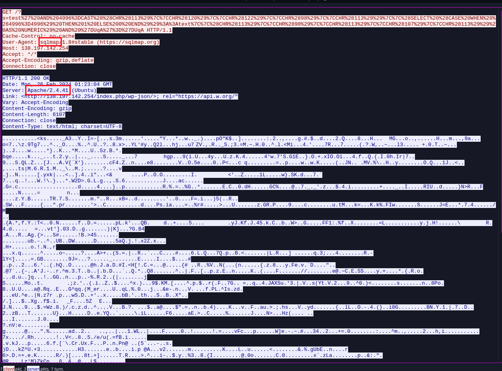
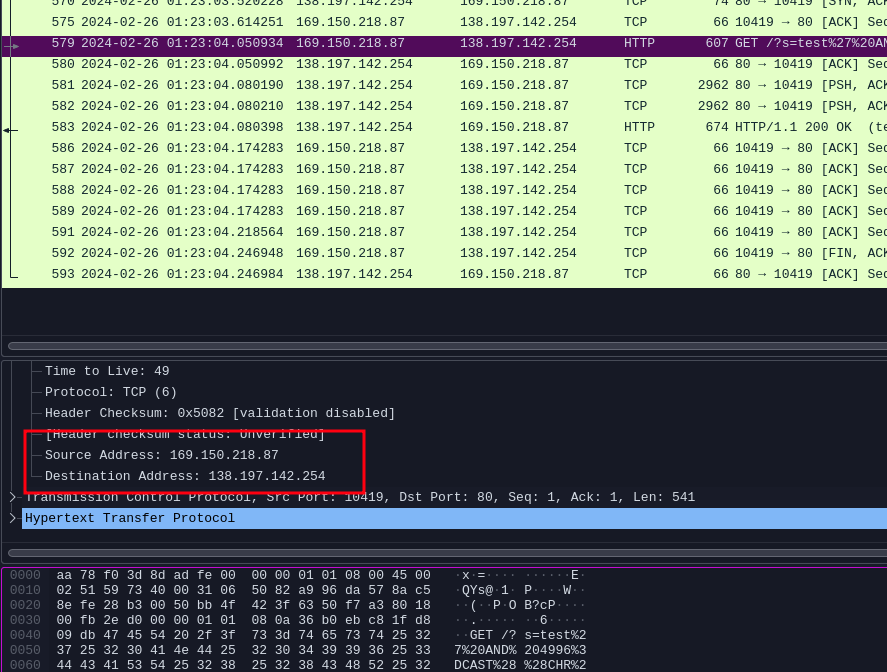

# Relizane is Down

**Difficulty:** Easy 
**Category:** Forensics 
**Source Files:** Available (pcapng)
**Authors:** @Houssem0x1 & 0utc4st 
**Description:** The Relizane City residents' community blog's server has been  compromised. Our efforts to look into the matter and follow the hacker's trail are fully committed. Please assist us in advancing this  investigation by obtaining the following information:

- The IP adress of the attacker.
- The IP adress of the compromised server.
- The name of the compromised web-server deployed in the enviroment.(lowercase)
- The version of this compromised web-server.

**Flag format: nexus{AttackerIP_VictimIP_WebServerName_WebsServerVersion}**

## Solution

a good strategy here is to find a malicious packet, from where we can extract the attacker and the victim IP addresses.

we found one packet that contained `sqlmap` in the user-agent, since sqlmap is a famous tool for automating sql injections attacks, we can safely assume that this packet is malicious :

we also see the server name and version which are : `apache 2.4.41`

so we grab the attacker and the victim IP addresses from this packet :

with that we have our flag

## Flag

`nexus{169.150.218.87_138.197.142.254_apache_2.4.41}`