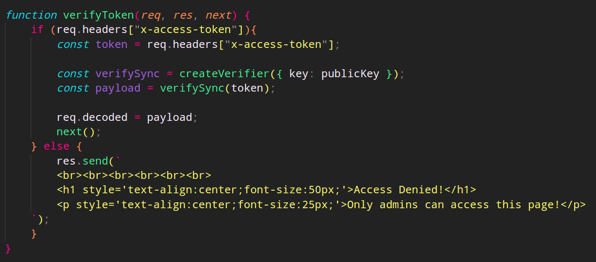
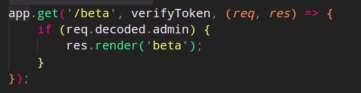

# Jack of All Trades

**Difficulty:** Hard
**Category:** Web
**Source Code:** Available
**Authors:** 0utc4st & not1cyyy
**Description:** What a fun collab! well, at least for us :wink: 

## Source Code
- nodejs app
```javascript
const express = require('express');
const { createSigner, createVerifier } = require('fast-jwt')
const fs = require('fs');
const path = require('path');
const bodyParser = require('body-parser');
const app = express();
const port = 3000;
const publicKeyPath = path.join(__dirname, 'public_key.pem');
const publicKey = fs.readFileSync(publicKeyPath, 'utf8');
const privateKeyPath = path.join(__dirname, 'key');
const privateKey = fs.readFileSync(privateKeyPath, 'utf8');

app.use(express.json());
app.use(bodyParser.json({ type: 'application/json' }));

const handlebars = require('express-handlebars');
app.engine('handlebars', handlebars({ layoutsDir: __dirname + '/views/layouts', defaultLayout: false }));
app.set('view engine', 'handlebars');

app.get('/generateToken', async (req, res) => {
    const payload = { admin: false, name: req.query.name };

    const signSync = createSigner({ algorithm: 'RS256', key: privateKey });
    const token = signSync(payload);

    res.json({ token });
});

function verifyToken(req, res, next) {
    if (req.headers["x-access-token"]){
        const token = req.headers["x-access-token"];

        const verifySync = createVerifier({ key: publicKey });
        const payload = verifySync(token);

        req.decoded = payload;
        next();
    } else {
        res.send(`
        <br><br><br><br><br><br>
        <h1 style='text-align:center;font-size:50px;'>Access Denied!</h1>
        <p style='text-align:center;font-size:25px;'>Only admins can access this page!</p>
    `);
    }
}

app.get('/beta', verifyToken, (req, res) => {
    if (req.decoded.admin) {
        res.render('beta');
    }
});

app.post('/beta',verifyToken, async (req, res) => {
    if (req.decoded.admin) {
        try {
            const jsCode = req.body.code;

            const flaskResponse = await fetch('http://flask_app:5000/execute-js', {
                method: 'POST',
                headers: {
                    'Content-Type': 'application/json'
                },
                body: JSON.stringify({ code: jsCode })
            });

            const resultData = await flaskResponse.json();
            const result = resultData.result;
            res.json(result);
        } catch (error) {
            console.error(error);
            res.status(500).json({ error: 'Internal Server Error' });
        }
    }
});


app.get('/', (req, res) => {
    res.send(`
        <br><br><br><br><br><br>
        <h1 style='text-align:center;font-size:50px;'>Welcome!</h1>
        <p style='text-align:center;font-size:25px;'>The site is still under development</p>
    `);
});


app.listen(port, () => {
    console.log(`Server is running on port ${port}`);
});
```

- flask app (internal) :
```python
from flask import Flask, request, jsonify
import js2py

app = Flask(__name__)

@app.route('/execute-js', methods=['POST'])
def execute_js():
    try:
        js_code = request.json['code']
        js_result = js2py.eval_js(js_code)
        return jsonify({'result': str(js_result)})
    except Exception as e:
        return jsonify({'error': str(e)}), 500

if __name__ == '__main__':
    app.run(debug=False)
```

## Solution

After reading through the source code, we see that there's an endpoint that generates a JWT token. The token is generated using the `RS256` algorithm with the imported keys in the beginning. 


This is what the JWT token looks like in [jwt.io](https://jwt.io/):

```json
{
  "alg": "RS256",
  "typ": "JWT"
}
{
  "admin": false,
  "iat": 1708973109
}
```

We also see that the token is signed using the private key and the public key is used to verify the token. Typical JWT token generation and verification process.



With further analysis, we see an endpoint called `/beta` which requires a valid JWT token to access.



This hints that we need to generate a valid JWT token to access the `/beta` endpoint. HOW ??!!?!?

The answer is, through algorithm confusion !!

First, we need to recover the public key from the server, we can do this using 2 or more different JWT tokens using [this tool](https://github.com/silentsignal/rsa_sign2n/blob/release/standalone/jwt_forgery.py) 

```bash
python3 jwt_forgery.py token1 token2
```

This will generate AT LEAST 4 different public keys that only have 2 formats, `pkcs1` and `x509`:


Now we go modify our JWT token at [jwt.io](https://jwt.io/) to use the `HS256` algorithm instead of `RS256` and then copy the resulting token:


Finally, for each of the keys generated, we try signing out forged JWT token with the `HS256` algorithm using [this tool](https://github.com/ticarpi/jwt_tool):

```
python3 jwt_tool.py --exploit k -pk public_key_generated token
```

 

after getting the token, we add it to our headers in form of :

```plaintext
x-access-token: JWT_TOKEN
```
Eventually, we will get a valid JWT token that we can use to access the `/beta` endpoint, Bingo


we have now access to the `/beta` endpoint.

as we seen earlier in the source code, this will grab our input, and passes it to the internal flask app, which contain this code :

```python
from flask import Flask, request, jsonify
import js2py

app = Flask(__name__)

@app.route('/execute-js', methods=['POST'])
def execute_js():
    try:
        js_code = request.json['code']
        js_result = js2py.eval_js(js_code)
        return jsonify({'result': str(js_result)})
    except Exception as e:
        return jsonify({'error': str(e)}), 500

if __name__ == '__main__':
    app.run(debug=False)
```

we see that the `/execute-js` endpoint accepts data from that `beta` endpoint, then passes that through `js2py` to convert the given input to python and execute it, this way we can execute javascript from the `beta` endpoint easily.

in theory this code is not vulnerable, but digging a bit into `js2py`'s documentation, we will discover that this library has a feature to actually import and run python code in that `eval_js` method.

the way it works is by specifying `pyimport` and then importing any python package we want, and execute python code with it.

so this should give us `blind remote command execution` :

```
pyimport os; os.system("COMMAND")
```

but since the flag is in an environement variable, ,we can get it with :

```
pyimport os; os.environ.get("flag")
```

let's try that :


## Flag

`nexus{00ps1Es_d1dNt_MEan_t0_C0nfuse_y0U_tw1c3}`